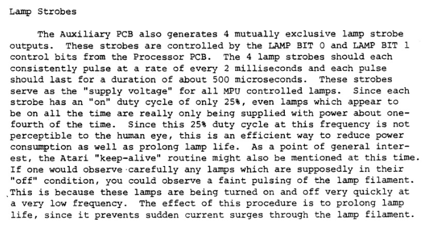

# Lamp Refresh Analysis — Original Atari Gen1 vs. AtariFA (2026-07-10)

> **Question that triggered this analysis:** On the original Atari, lamp replacement with LEDs
> does not work — the LEDs are always faintly lit ("pre-glow" / *Vorglühen*). This is commonly
> attributed to a **refresh routine deliberately injecting short "on" phases even for lamps that
> are switched off**, in order to keep the incandescent filaments warm. That claim is not a forum
> invention: it comes from **Atari's own service literature** — the *Atari Pinball Troubleshooting
> Guide* calls it the "keep-alive routine" (§3). On AtariFA, LEDs used as test lamps work perfectly
> (cleanly on/off), which suggested a different refresh mechanism.
> This document establishes **definitively** how the original refresh works and why AtariFA behaves
> differently — and clears the concern that the AtariFA refresh logic might over-drive 5 V test LEDs.

---

## TL;DR / Verdict

**The Atari Gen1 lamp refresh is pure hardware (DMA). The CPU / game software does *not* refresh
the lamps at all — it only maintains a static on/off image in RAM `0x30–0x3F`.**

Consequently the keep-alive claim ("the refresh routine injects on-phases for off-lamps") **does not
apply to Atari Gen1** — there is no software refresh loop into which on-phases could be injected.
**Measured and confirmed on 2026-08-09** with a logic-analyser capture on the prototype: with a ball
sitting in the shooter lane the CPU wrote to lamp RAM *not once in 25.7 s* while the matrix kept
driving lit lamps — see §6. The
"pre-glow" is therefore a **hardware artifact** of the original strobed lamp matrix
(row latches reloaded while a column is live, plus driver leakage — §3.3), invisible on a hot
incandescent filament but above an LED's turn-on
threshold. AtariFA re-implements the driver cleanly (with hard blanking) and does not reproduce this
artifact — which is exactly why LEDs work as test lamps.

**What the Troubleshooting Guide got right and wrong:** its *observation* ("a faint pulsing of the
lamp filament" on lamps that are supposedly off) is correct and reproducible on the original. Its
*explanation* — that this is a deliberate routine — is not. Nothing in the machine can pulse an
individual off-lamp except the RAM image, and the RAM image demonstrably does not do it (§6.6). The
Aux board, the only other candidate, cannot do it either: it never sees a lamp, only a column (§3.2).

---

## 1. How the original refreshes lamps: DMA, not software

In Atari Gen1 the display **and** the lamps are refreshed by a **DMA mechanism**: a hardware timing
chain periodically halts the 6800 (HALT/DMA) and autonomously scans the low RAM (`0x00–0x3F`). During
this scan the RAM bytes are latched into the peripheral drivers:

- `0x00–0x1F` → score/status **display** (7-segment multiplex).
- `0x30–0x3F` → **lamp** latches (schematic Sheet 18A: `9334` addressable latches selected by address
  bits A2/A3/A7; the four column strobes **SA/SB/SC/SD** multiplex the 21×4 matrix). One column per
  digit slot ⇒ the lamp matrix is scanned twice per display frame, 2.048 ms per lamp frame — see §3.1.

The CPU is frozen during the refresh. **The game code never runs a per-lamp refresh loop** — it simply
writes the desired on/off state to RAM `0x30–0x3F`, and the DMA hardware re-reads and re-drives that
image every frame.

> This is the same architecture as the display refresh, documented in
> [`Display_Timing.md`](Display_Timing.md) §2 ("Originaler Mechanismus: DMA").

---

## 2. Evidence

Three independent sources agree.

### 2.1 PinMAME model — lamp state == RAM content

`doc/atari.c`, Gen1 RAM write handler `ram_w` (lines 233–244):

```c
} else if (offset > 0x2f && offset < 0x40) {
    /* lamps (128 of them!) */
    int col;
    offset -= 0x30;
    col = (offset%4)*2 + offset/8;
    if (offset % 8 < 4) {
        coreGlobals.lampMatrix[col]   = (coreGlobals.lampMatrix[col]   & 0xf0) | (data & 0x0f);
        coreGlobals.lampMatrix[col+8] = (coreGlobals.lampMatrix[col+8] & 0xf0) | (data >> 4);
    } else {
        coreGlobals.lampMatrix[col]   = (coreGlobals.lampMatrix[col]   & 0x0f) | (data << 4);
        coreGlobals.lampMatrix[col+8] = (coreGlobals.lampMatrix[col+8] & 0x0f) | (data & 0xf0);
    }
}
```

The lamp matrix is set **exclusively** by CPU writes to RAM `0x30–0x3F`. Nothing else touches it; there
is no refresh routine and no on-phase injection. (AtariFA's `lamp_sniffer` in `AtariFA.vhd` mirrors this
exactly: it snoops the same RAM writes into `lamp_state`.)

### 2.2 PinMAME Gen1 interrupts do not handle lamps

`doc/atari.c`:

- `ATARI1_nmihi` (line 52): the NMI handler only pulses the NMI line and toggles the DMA counter —
  nothing to do with lamp values.
- `ATARI1_vblank` (line 81): handles solenoids and display smoothing, but has **no lamp handling** at
  all.

> Note: the `ATARI_LAMPSMOOTH` copy at line 103 belongs to **`ATARI2_vblank` (Gen 2)**, which uses a
> separate `lamp_w` handler and `tmpLampMatrix`. It is **not** used by the five Gen1 games
> (Atarians, Time 2000, Airborne, Middle Earth, Space Riders).

### 2.3 Real ROM disassembly (Airborne Avenger)

Generated with:

```
python tools/dis6800.py airborne.e00.hex airborne.e0.hex --name "Airborne Avenger" --out airborne_listing.txt
```

**Lamp control is a clean read-modify-write of a single bit** (`0x7BB1–0x7BC6`):

```
7BB1  LDAA #$10        ; single-bit mask
7BB3  TSTB
7BB4  BGE  $7BB7
7BB6  COMA             ; optionally invert the mask  -> $EF
7BB7  STAA $14         ; scratch
7BB9  LDX  $12
7BBB  LDAA $30,X       ; read current lamp RAM byte (0x30 + X)
7BBD  TSTB
7BBE  BGE  $7BC4
7BC0  ANDA $14         ; lamp OFF -> clear the bit
7BC2  BRA  $7BC6
7BC4  ORAA $14         ; lamp ON  -> set the bit
7BC6  STAA $30,X       ; write back to lamp RAM
```

A lamp that is switched off has its bit cleared to 0 and **stays 0** in RAM. All other lamp bits are
preserved. There is no injection of "on" states for off-lamps. These writes are **event-driven** (only
when a lamp actually changes state), not periodic.

Furthermore, the **244 Hz NMI ISR** (`0x7DBE`) is only a RAM-integrity / watchdog check — it never
writes lamp RAM:

```
7DBE  LDAA $D9 / CMPA #$AA / BNE reboot   ; sentinel 1
7DC4  LDAA $DA / CMPA #$55 / BNE reboot   ; sentinel 2
7DCA  TSX / LDAA $05,X / range-check      ; stacked PC sanity
7DD5  RTI                                 ; ... else JMP $7000 (reboot)
```

---

## 3. Where the "keep-alive" claim comes from — and what it really describes

The claim is not folklore. It is printed in Atari's own service literature, the **Atari Pinball
Troubleshooting Guide** (`N:\Projekte\FPGA Atari\Manuals\Atari Troubleshooting guide.pdf`), section
*Lamp Strobes*, scanned here as [`Lamp_Strobes_Manual.png`](Lamp_Strobes_Manual.png):



> "The Auxiliary PCB also generates 4 mutually exclusive lamp strobe outputs. These strobes are
> controlled by the LAMP BIT 0 and LAMP BIT 1 control bits from the Processor PCB. The 4 lamp strobes
> should each consistently pulse at a rate of every 2 milliseconds and each pulse should last for a
> duration of about 500 microseconds. […] Since each strobe has an 'on' duty cycle of only 25 %, even
> lamps which appear to be on all the time are really only being supplied with power about one-fourth
> of the time. […] As a point of general interest, the Atari 'keep-alive' routine might also be
> mentioned at this time. If one would observe carefully any lamps which are supposedly in their 'off'
> condition, you could observe a faint pulsing of the lamp filament. This is because these lamps are
> being turned on and off very quickly at a very low frequency. The effect of this procedure is to
> prolong lamp life, since it prevents sudden current surges through the lamp filament."

The guide is written for Gen1 in general, not for one particular game, so the statement nominally
covers all five target titles. Two things follow from it, and they pull in opposite directions:
its **timing figures independently confirm** the DMA model of §1 (§3.1), while its **causal claim**
survives neither the schematic (§3.2) nor the measurement (§6.6). §3.3 reconciles the two.

For context: systems that **software-multiplex** their lamps (Gottlieb System 1, various Bally
generations) do run the lamp scan in a CPU loop, and there a refresh loop *can* briefly energize
off-lamps. Atari Gen1 is architecturally different — the CPU does not scan the lamps, the DMA
hardware does — so there is no loop into which on-phases could be injected.

### 3.1 The guide's own numbers confirm the DMA model (and correct one of ours)

| | Troubleshooting Guide | derived from the DMA chain | AtariFA, measured (§6.7) |
|---|---|---|---|
| Strobe pulse | "about 500 µs" | 512 µs = **one digit slot** | 250.04 µs |
| Strobe period | "every 2 ms" | 2.048 ms = 4 digit slots = **½ display frame** | 1.039 ms |
| Duty per lamp | "only 25 %" | 25 % | 24.04 % |
| Lamp frame rate | ~500 Hz | 488.3 Hz | 961.4 Hz |

The digit slot of 512 µs and the 4.10 ms display frame are measured values from
[`Display_Timing.md`](Display_Timing.md) (§ "Digit-Periode" / "Frame-Periode"). The lamp strobes
land on exactly four of those slots, i.e. the lamp matrix is scanned **twice per display frame** —
one column per digit slot. That is the same DMA timing chain seen from the lamp side, and it
matches the address decode: within RAM `0x30–0x3F` the low two address bits select the strobe
(`LAMP BIT 0/1`) and bits 2/3 select the row latch, so one strobe phase corresponds to exactly the
four bytes `0x30+s`, `0x34+s`, `0x38+s`, `0x3C+s` being written to the four row latches
`0x1000/1004/1008/100C`.

**This corrects §5(a)**, which used to compare AtariFA against "the original ~244 Hz": that is the
**display** frame. The original *lamp* frame is ~488 Hz, so AtariFA runs 2× faster than the original,
not 4×. The duty cycle, which is what actually sets brightness, is identical (25 % vs. 24 %) and is
now confirmed verbatim by Atari.

### 3.2 Is there a keep-alive circuit on the Aux board? No — and there cannot be one

The lamp section of the Auxiliary PCB ([`Auxiliary_PCB.png`](Auxiliary_PCB.png), Sheet 10A) is a
plain 1-of-4 column driver:

```
LAMP BIT 0 (J12-L) ─┐
LAMP BIT 1 (J12-K) ─┴─► 6× 7402 NOR (A3/B2: two as inverters, four as the 1-of-4 decode)
                        ─► MC1413 (A1) Darlington sink
                           ─► 39 Ω 2 W (R40/41/46/47) into the base of
                              4× 2N5883 PNP high-side (Q6…Q9), 8.2 K base-emitter (R42…R45)
                              ─► STROBE A (J13-1), B (J13-2), C (J15-3), D (J15-4 + J15-10 coin door)
```

The common emitter rail "LAMP PWR" (J11-5) is set by Q5, a 2N6282 Darlington whose base is
referenced by R35 390 Ω / CR19 1N5242B (12 V zener) — i.e. the strobes do **not** carry the raw
+20 V but roughly 10–11 V, which at 25 % duty gives ~5.3 V RMS across a #44/#47 lamp. (Read off the
sheet, not measured; it does not affect the argument below, only the wording "20 V matrix".)

Two independent reasons why this cannot produce a keep-alive:

1. **No enable, no timer, no one-shot.** The decoder inputs are `LAMP BIT 0/1` and nothing else —
   verified at full zoom on the scan. Four NOR outputs cover all four input combinations, so
   **exactly one strobe is always active**; the guide says the same ("4 mutually exclusive") and its
   own numbers confirm it (4 × 500 µs = the full 2 ms, no gap). The Aux board can therefore neither
   blank nor insert an extra pulse.
2. **It has no idea what a lamp is.** It receives two bits — a *column*. Any pulse it could generate
   would be column-wide, i.e. it would light every lamp whose row driver happens to be on. Per-lamp
   state exists only in the eight **9334** addressable latches on the Processor PCB
   ([`Lamp_Logic2.png`](Lamp_Logic2.png), Sheet 18A — one 9334 per data bit, addressed by A2/A3/A7),
   and those are loaded exclusively by the DMA from RAM `0x30–0x3F`.

### 3.3 What actually produces the pre-glow

Combining the two: a short "on" pulse for an individually selected off-lamp can only originate from
(i) the RAM image — measured absent in §6.6 — or (ii) a **row/column mismatch while a column is
live**. And (ii) is structurally unavoidable in the original:

- one column is powered at all times (§3.2), there is no blanking window;
- during that phase the DMA reloads the four row latches with the *new* pattern.

Whichever of the two switches first, there is an interval in which live outputs see a row pattern
belonging to a different column: every lamp that shares a row with a lit lamp of the neighbouring
phase gets a short pulse, every 2 ms. Order of magnitude: four DMA write cycles at ~1 µs against a
512 µs slot ⇒ well under 1 % duty — far too little to change a hot filament visibly, far more than
an LED needs to conduct. Add the leakage of the three un-driven PNP high-side drivers (R42…R45 hold
them firmly off, so only collector leakage reaches the column) and the picture is complete.

That is precisely the "faint pulsing of the lamp filament" the guide describes. It is a side effect
of an unblanked design that Atari's service department rationalised as a feature. AtariFA blanks
(`oe_n`) during shifting *and* during the strobe change, measured with **0 violations in 38 503
phases** (§6.7) — which is why LEDs are cleanly off here.

---

## 4. What AtariFA does — and why LEDs work

- **Data source:** `lamp_sniffer` (`AtariFA.vhd`) snoops CPU writes to RAM `0x30–0x3F` into
  `lamp_state(127:0)` — identical in spirit to PinMAME's `ram_w`. It captures only the *true* static
  on/off image.
- **Scan / multiplex:** `lamp_matrix.vhd` re-creates the 21×4 matrix (three cascaded 74HC595 →
  12× ULN2003A rows, four SA/SB/SC/SD strobes) with a free-running FSM. During shifting and strobe
  switching it **hard-blanks all rows** (`oe_n = '1'`), so an off-lamp bit produces exactly **0 mA** —
  no sneak path, no pre-glow.

**Empirical cross-check (decisive):** AtariFA executes the *original* game ROM. If the pre-glow were a
software effect (the ROM writing on-patterns into `0x30–0x3F`), the sniffer would faithfully reproduce
it and the test LEDs would glow. They do not (HW-tested, `lamp_matrix.vhd`, Phase B). This is a direct
empirical confirmation that the original pre-glow is a **hardware** artifact, consistent with the ROM
disassembly above.

---

## 5. Brightness & voltage — no risk to 5 V test LEDs

Two concerns raised, both resolved:

**(a) Are the original incandescent lamps driven too hard / too bright by AtariFA?** No.
- Incandescent brightness depends on **average power**; the filament's thermal time constant (many ms)
  integrates over many pulses, so the **refresh frequency is irrelevant** to brightness.
- Duty cycle is what matters: AtariFA runs **~24 %** per lamp (one of four strobe phases,
  `DWELL_CYCLES = 12500` ≈ 250 µs of ~1040 µs/frame), structurally capped at ~25 % because only one
  strobe is ever active at a time. The original 4-fold multiplex is likewise **~25 %** — stated
  verbatim in the Troubleshooting Guide ("each strobe has an 'on' duty cycle of only 25 %", §3.1).
  → essentially identical average power → same brightness (if anything marginally dimmer on AtariFA
  due to shift overhead). AtariFA's lamp frame rate is ~961 Hz vs. the original **~488 Hz**
  (2.048 ms, §3.1 — the 244 Hz figure is the *display* frame, not the lamp frame), but that only
  changes flicker frequency, not average power.

**(b) Can the refresh logic over-voltage the 5 V test LEDs?** No.
- The FPGA refresh logic only controls **timing (on/off), never voltage**. The peak voltage across a
  lamp when on is set purely by hardware: strobe-rail voltage − driver drop − series resistor.
- The 5 V test LEDs sit on a **physically separate path**: the "Box connectors" provide the four lamp
  strobes via **four P-channel MOSFETs, for test LEDs only** (`AtariFA.vhd` header, section 4),
  independent of the Aux board's incandescent strobes (the `LAMP PWR` rail, §3.2). Whatever rail
  voltage feeds that test path is a hardware choice; the refresh FSM cannot raise it.
- The only software-side brightness knob is `DWELL_CYCLES` in `lamp_matrix.vhd` (duty), not voltage.

---

## 6. Measurement-based verification (8-channel logic analyser)

Sections 1–4 are a paper argument (PinMAME model, ROM disassembly, architecture). This section
turns it into a measurement on the AtariFA prototype. The lever: **AtariFA executes the very same
game ROM as the original machine**, and the only way software can influence lamps at all is a write
into RAM `0x30–0x3F`. Capture those writes without gaps and the software side is settled.

`DBG_MODE = 4` in `AtariFA.vhd` provides the channel assignment. The whole trace logic lives inside
the `gen_dbg4` / `gen_dbg5` generate blocks, so with the default `DBG_MODE = 0` nothing of it is
elaborated and the synthesis baseline (`scripts/baseline.csv`) is unaffected.

### 6.1 `DBG_MODE = 4` — long capture (main measurement)

Designed for 500 kHz…1 MHz sampling over seconds to minutes on a simple 8-channel LA. The three
event channels are stretched to ~1 ms (`DBG_STRETCH_CYCLES`) so they survive that sample raster;
the matrix channels are raw (250 µs / ~10 µs, comfortably visible at 1 MHz).

| Ch | Pin (`cyclone_10_pcb`) | Signal | What it proves |
|---|---|---|---|
| 0 | PIN_66 | `lamp_wr` — CPU write to RAM `0x30–0x3F`, stretched | Are there periodic lamp writes at all? No pulse over seconds ⇒ no software refresh, end of discussion. |
| 1 | PIN_68 | `lamp_wr_chg` — written value differs from the stored byte | Separates a real change from re-writing the same value. |
| 2 | PIN_75 | `lamp_wr_set` — at least one bit goes 0→1 | **The key channel.** The keep-alive claim requires periodic 0→1 edges for lamps that are off. |
| 3 | PIN_59 | `watch_state` — `lamp_state` bit of `DBG_WATCH_LAMP` | Software-side state of the chosen off-lamp: must stay flat `'0'`. |
| 4 | PIN_55 | `watch_drive` — drive of that lamp (row bit AND strobe phase AND not blanked) | Shows *when* that lamp would be due, and catches short blips in channel 3. **Do not over-read it:** inside the FPGA it is derived from channel 3, so a flat channel 3 forces a flat channel 4. It cannot reveal a sneak path — there is none here (see §6.5). |
| 5 | PIN_53 | `any_drive` — **any** of the 84 lamps currently driven | Counter-check against the negative-proof trap: ~250 µs pulse every ~1.04 ms (~24 % duty). Without it, channels 3/4 are worthless. Deliberately not tied to a named reference lamp, so the counter-check needs no lamp number and holds in any state where something is lit. |
| 6 | PIN_51 | `lamp_oe_n` | The blanking window: high during shift/latch (~10 µs), low during dwell. |
| 7 | PIN_49 | 244 Hz NMI pulse | Time base. If the lamp writes sit on this raster, it *is* a refresh. |

`DBG_WATCH_LAMP` is a lamp number in the FA-Control numbering (`n = (595 group − 1) × 4 + strobe`,
0…83, see `rtl/common/lamp_map_pkg.vhd`). It is the only lamp number the trace needs, and it only
feeds channels 3/4 — the channels that decide the question (0/1/2/7) do not depend on it at all.
Channel 3 tells you directly whether the chosen lamp really is off during the capture; if it blinks,
pick another number and repeat.

`cyclone_10_dev_open` only routes three debug lines; the measurement needs `cyclone_10_pcb`.

**Deliberate detail:** channels 0–2 qualify on the RAM-decoded address
(`ram_wren = '1' and cpu_addr(8 downto 4) = "00011"`), *not* on the sniffer condition
`cpu_addr(15 downto 4) = x"003"`. That also catches writes through the RAM mirror
(`0x1030–0x103F`), which the sniffer would miss — otherwise "no pulse" would not be a complete
proof. (Channel 0 firing without a corresponding page-0 write would itself be a finding: the
sniffer would then not see the lamps.)

### 6.2 `DBG_MODE = 5` — detail capture (optional)

`ser` / `srck` / `rck` / `oe_n` / `strobe_sel(1:0)` / `watch_drive` / `lamp_wr` (stretched to
~200 ns). Shows one complete multiplex phase at 24 MHz. The same signals are also available at the
board pins — `oe_595` (PIN_38), `clk_595` (PIN_39), `rclk_595` (PIN_42), `aux_lamp_strobe` — this
mode merely bundles them on the LA header and adds the reconstructed lamp drive.

### 6.3 Procedure

1. Set `DBG_MODE := 4` plus `DBG_WATCH_LAMP`, run
   `scripts\build.ps1 cyclone_10_pcb`, program the prototype.
2. LA on PIN_66/68/75/59/55/53/51/49 + GND, 500 kHz…1 MHz, 30–60 s, free-run in attract mode.
3. **Counter-check first:** channel 5 must show the ~250 µs / ~1.04 ms pattern and channel 6 the
   blanking window. Without that the rest is not interpretable.
4. Capture **during a game** and **in attract**, both are needed:
   - *During a game* few lamps are lit, so a stable off-lamp is easy to pick. The quietest moment is
     the ball sitting in the shooter lane right after start — play state, few lamps, no events.
     This is the better capture for channels 3/4.
   - *In attract* many lamps blink, which makes the lamp choice awkward — but this is the state the
     keep-alive claim is actually about, so it cannot be skipped. The lamp choice matters less here:
     channels 0/1/2/7 (the ones that decide the question) do not depend on it at all, and channel 3
     tells you directly whether the chosen watch lamp is really off — if it blinks, pick another
     number and repeat.
   - Optionally the lamp self-test as a contrast capture.
5. Afterwards set `DBG_MODE` back to `0` and run `scripts\check.ps1 -Fit` against the baseline
   before committing anything.

### 6.4 Reading the result

| Observation | Interpretation |
|---|---|
| **Ch 0 silent while ch 5 keeps pulsing** | Decisive. Lamps stay lit with *zero* CPU writes ⇒ the lit state comes from the static RAM image alone, there is no software refresh. |
| Ch 3 and 4 flat `'0'` throughout while ch 5 pulses cleanly | The watch lamp stays off for the whole capture — and ch 5 proves the capture was live while it did |
| Ch 0 periodic, but ch 1 pulses with it | Periodic writes that *change* the byte every time = an animation stepping on a timer, **not** a refresh. A refresh rewrites identical values, which would show as ch 0 without ch 1. |
| Ch 0 periodic **and ch 1 mostly silent** | That would be a genuine rewrite loop — then look at ch 3 to see whether an off-lamp bit is part of it. |
| Ch 3 shows short spikes during its off period, spaced on the ch 0 raster | **This document would be wrong** — that is the claimed keep-warm injection; revise sections 1–4. |

Note that "ch 0 is periodic" alone proves nothing. Attract animations are stepped by a timer derived
from the 244 Hz NMI, so their lamp writes are strictly periodic *by construction* — see the measured
result in §6.6, where they land on exactly every 20th NMI. The refresh question is decided by ch 1
(does the value actually change?) and by the in-play capture (are there any writes at all?).

### 6.5 What this trace does *not* cover

It settles the **software** side — the falsification of the keep-alive claim — because the same ROM
code runs here as on the original machine. Three things remain open:

- It does **not** positively prove the driver-side cause of the original pre-glow. §3.3 makes the
  row/column mismatch mechanism structurally compelling (schematic-supported: the Aux decoder cannot
  blank, and the guide's own 4 × 500 µs in 2 ms leaves no gap), but "compelling" is not "measured".
  That would need either a capture on the original MPU's lamp driver signals (9334 latches / SA–SD
  strobes, looking for the row-data/strobe overlap) or a controlled counter-experiment: make the
  blanking in `lamp_matrix.vhd` switchable, drop it, and see whether the glow reappears on the real
  playfield. Both steps — what to look for on the machine first, and how the switchable version
  would be built — are written up in
  [`Lamp_Preglow_Experiment.md`](Lamp_Preglow_Experiment.md) (planned 2026-08-10, nothing built yet).
- Only **Airborne Avenger** was captured. The Troubleshooting Guide is written for Gen1 in general,
  so strictly speaking the other four ROMs are untested. Re-running §6.3 for each is cheap (one build
  with `DBG_MODE = 4`, then switch `game_select`), and the decisive channel 0 needs no lamp number.
- The exact ordering inside a strobe phase of the original — strobe switch first or latch reload
  first — is not established. §3.3 does not depend on it (either order opens the same window), but a
  capture on an original board would pin it down.

### 6.6 Results — measured 2026-08-09, `DBG_MODE = 4`, `DBG_WATCH_LAMP = 8`

**Airborne Avenger** (`game_idx = 2`) on the prototype, SW 0.1.3. Two captures, Saleae-style edge
export, 25.7 s (in play) and 27.5 s (attract).

**Sanity of the capture itself** (identical in both, and matching the design):
`oe_n` blanking 9.8 µs, dwell 250 µs ⇒ 260 µs per strobe phase, 1.04 ms per lamp frame;
NMI period 4096.9 µs = **244.1 Hz**, exactly the value `Display_Timing.md` derives.

| State | Ch 0 (writes) | Ch 1 (changed) | Ch 2 (0→1) | Ch 3 (lamp 8) | Ch 5 (any lamp) |
|---|---|---|---|---|---|
| **In play**, ball in shooter lane, 25.7 s | **none at all** | none | none | flat `'0'` | pulsing the whole time |
| **Attract**, 27.5 s | 203 bursts, every **81.94 ms** | 203 — identical to ch 0 | 139 | clean 1.31 s on / 1.72 s off | pulsing |

**Verdict: the keep-alive claim is refuted as a software mechanism; sections 1–4 hold.**

1. *In play the CPU does not touch lamp RAM at all* — not one write in 25.7 s, while ch 5 shows the
   matrix driving lit lamps throughout. A software refresh that is absent for 25 seconds is not a
   refresh. The lit state comes from the static RAM image alone, exactly as sections 1–4 describe.
2. *The attract writes are an animation, not a refresh.* They are strictly periodic —
   81.94 ms = **exactly 20 NMI periods** (12.2 Hz), phase-locked to ch 7 with a spread of 0.001 —
   which is what a timer-stepped attract animation looks like. What rules out a refresh is ch 1:
   it fires on **every single** one of the 203 bursts, i.e. every write actually changes the byte.
   A keep-warm refresh would rewrite identical values and leave ch 1 silent.
3. *No on-phase injection for an off lamp.* Lamp 8's own bit is a clean square wave (9 pulses,
   1.31 s on, 1.72 s off) with no short spikes during its off periods — no 81.94 ms blips, nothing.
   Had the ROM injected keep-warm pulses, they would appear right here.

The 0→1 events on ch 2 (139 of them) are other lamps in the animation being switched on; they are
byte-wide events and carry no information about a specific lamp, which is what ch 3 is for.

### 6.7 Overlap window — `DBG_MODE = 5`, 10 s at 24 MHz, attract

The one thing §6.6 cannot answer: is there an instant at which the row data has already been
switched while the column strobe still belongs to the previous phase *and the outputs are live*?
That is the half-select mechanism the original's pre-glow is attributed to. Capture: 10.005 s,
1.9 M edges, **38 503 complete strobe phases**.

| Quantity | Measured | Design value |
|---|---|---|
| Blanking window (`oe_n` high) | 9.792 µs [9.791 … 9.834] | 24 × 400 ns shift + latch ≈ 9.8 µs |
| Visible window (`oe_n` low) | 250.042 µs [250.041 … 250.084] | `DWELL_CYCLES` 12500 × 20 ns = 250 µs |
| Phase period / frame | 259.8 µs / 1.039 ms | ~962 Hz frame rate |
| Shift bit clock | 416 ns → 2.40 MHz | `SHIFT_DIV` 10 → 2.5 MHz |
| `rck` → output enable | 208 ns [166 … 209] | one shift tick |
| strobe change → output enable | 208 ns [166 … 209] | same tick — `rck` and strobe switch together |

**Violations (event while `oe_n` = 0, i.e. outputs live), over 38 503 phases:**

| Event | Count |
|---|---|
| `rck` (latch) while live | **0** |
| strobe change while live | **0** (see note) |
| `srck` (shifting) while live | **0** |

*Note on the strobe count:* the raw scan reports exactly one hit — at **row 1 of the file**, the
first recorded transition, at t = 85.333 µs. That is 2048 samples at 24 MHz, i.e. the capture
device's first block boundary; the `t = 0` row is the placeholder initial state, and `Aufnahme1`
shows its first transition at the identical 85.333 µs. It is a capture-start artifact, not a signal
event — a real strobe glitch during dwell would not occur exactly once in 10 s, precisely on the
first block boundary. Every one of the 38 503 genuine phase changes is blanked.

**Result:** `rck` and the strobe switch happen in the *same* clock edge, 208 ns before the outputs
are released, and the outputs were already blanked 9.8 µs earlier. There is no window in which live
outputs see a row/column mismatch.

**The original has no such blanking at all** — and that is not an assumption but follows from two
independent sources (§3.2/§3.3): the Aux board decodes `LAMP BIT 0/1` with a 7402 NOR array that has
**no enable input**, so exactly one of the four strobes is powered at every instant; and the
Troubleshooting Guide's own figures leave no room for a gap (4 × ~500 µs in a 2 ms period). Its 9334
row latches are therefore reloaded by the DMA while a column is live — exactly the structural
difference that makes LEDs work on AtariFA and pre-glow on the original.

#### 6.7.1 Side finding: the 24th shift pulse is only 20 ns wide

The `srck` count per blanking window splits **23 (20 008 windows) / 24 (18 495)**. Cause: in
`lamp_matrix.vhd` the `St_Latch` state clears `srck` on the very next `clk_50` edge instead of
waiting for a shift tick, so the final (24th) `SRCK` high pulse lasts **one clock period = 20 ns**
instead of 200 ns. Against the analyser's 41.7 ns sampling grid such a pulse is caught with
probability 20/41.7 = 48.0 % — and it was caught in 18 495 / 38 503 = **48.0 %** of windows. The
agreement confirms the width to be exactly one `clk_50` period.

It worked on this board (lamps HW-tested OK, and a missed 24th pulse would shift the whole cascade by
one group, which would be unmissable), but 20 ns sits right at the 74HC595's minimum clock pulse
width (~20 ns at 4.5 V, more over temperature) — there was no margin.

**Fixed 2026-08-09:** `lamp_matrix.vhd` got one extra FSM state, `St_ShiftLast`, which waits for a
shift tick with `srck` still high before entering `St_Latch`. The 24th pulse is now 220 ns wide,
like the other 23. Cost: +1 register (one-hot), +6 combinational, memory unchanged, slack
3.142 → 2.683 ns (inside the 1.5 ns tolerance); `scripts/baseline.csv` updated accordingly.

**Verified on hardware the same day** (`DBG_MODE = 5`, 1.813 s, 6973 windows, attract):

| Quantity | before the fix | after |
|---|---|---|
| `srck` edges per window | 23 / 24 split 52 : 48 | **24 in all 6972 genuine windows** |
| Blanking window | 9.792 µs | **10.000 µs** (+208 ns, as predicted) |
| Visible window (dwell) | 250.042 µs | 250.042 µs — unchanged to the nanosecond |
| Bit clock / release margin | 2.40 MHz / 208 ns | unchanged |
| Violations (latch/strobe/shift while live) | 0 | 0 |

The single window reported with 22 edges, an 8.916 µs blank and a 130 µs dwell sits at
t = 0.076…0.085 ms — the truncated first window at the capture-start block boundary, the same
artifact discussed in §6.7. Per-lamp duty went 24.06 % → 24.04 %, frame rate 962.2 → 961.4 Hz;
both differences are 0.08 % and cannot be seen.

---

## 7. Sources

- **Atari Pinball Troubleshooting Guide**, section *Lamp Strobes* — the origin of the "keep-alive"
  claim and the source of the original's lamp timing figures. Scan:
  [`Lamp_Strobes_Manual.png`](Lamp_Strobes_Manual.png); full document
  `N:\Projekte\FPGA Atari\Manuals\Atari Troubleshooting guide.pdf`.
- Aux-board lamp strobe generator: [`Auxiliary_PCB.png`](Auxiliary_PCB.png) (Section H, Sheet 10A —
  7402 decode, MC1413, 4× 2N5883, `LAMP PWR` via Q5/CR19).
- Processor-PCB lamp latches: [`Lamp_Logic2.png`](Lamp_Logic2.png) (Sheet 18A, eight 9334 addressable
  latches, one per data bit, addressed by A2/A3/A7) and [`Lamp_Logic.png`](Lamp_Logic.png)
  (Sheet 18D, ULN2003A row drivers).
- PinMAME reference: `doc/atari.c` (`ram_w` lamp handler, `ATARI1_nmihi`, `ATARI1_vblank`).
- ROM disassembly: `tools/dis6800.py airborne.e00.hex airborne.e0.hex` (Airborne Avenger; routine
  `0x7BB1–0x7BC6`, NMI ISR `0x7DBE`).
- Original DMA refresh mechanism: [`Display_Timing.md`](Display_Timing.md) §2 (same DMA chain drives
  display and lamps).
- AtariFA implementation: `lamp_matrix.vhd` (scan FSM, blanking) + `AtariFA.vhd` (`lamp_sniffer`,
  box-connector test-strobe path, header section 4).
